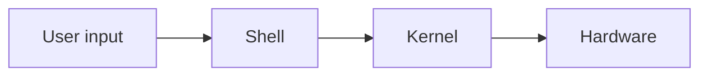

## 구조




```
drwxr-x--- 1 ubuntu ubuntu 512 Mar 8 09:23 .
drwxr-xr-x 1 root root 512 Mar 8 09:22 ..
-rw-r--r-- 1 ubuntu ubuntu 220 Mar 8 09:22 .bash_logout
-rw-r--r-- 1 ubuntu ubuntu 3771 Mar 8 09:22 .bashrc
-rw-r--r-- 1 ubuntu ubuntu 0 Mar 8 09:23 .motd_shown
-rw-r--r-- 1 ubuntu ubuntu 807 Mar 8 09:22 .profile
ubuntu@DESKTOP-78PK4D4:~$ echo "test" >> test.txt
```

- 제일 앞에 있는 것
  (drwxr-x---) 권한을 의미한다

- d : directory, 폴더

  - '-'는 파일?

- rwx | rwx | rwx << 권한

  - '-' 비어있음

- r : read
- w : write
- x : execute
- 소유자, 그룹, 제 3자

- rm : remove
- rf : 권한 무시

- pwd : print walking directory(현재 작업중인 경로)
- ~ 입력으로 home/주사용폴더 이동
- cat : 해당 파일을 읽어주는 역할
- mv : 이름변경(move)
- cp : copy

```bash
-vi test.txt (중요!!)
```

메모장
아래에 현재 모드에 대해서 적혀있다

- i : `--insert--`로 바뀌고 입력 모드
- esc 누르면 비어지며 통상 모드
- 통상 모드 시 저장, 종료 가능
  : 를 누르면 파일의 저장|종료 등 명령어를 입력할 수 있다.
- `:q` : 종료
- `:w` : 쓰기
- `:wq` : 쓰고 종료
- `!` : 강제 << 관리자 권한으로 실행
- `:!wq` : 강제로 저장하고 종료
- `:!q` : 강제로 종료한다 <<수정 후
  수정사항 날릴 때

## NginX

- 설치

```shell
sudo apt-get update
sudo apt-get upgrade
sudo apt-get install nginx
```

- 확인

```shell
sudo service nginx status
sudo service nginx start
```
